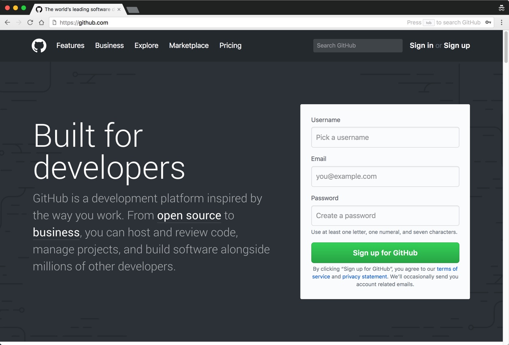

# Getting Started

### Overview

For this course, you only need to have two things on your computer: **Docker** and a **text editor**.

That's it! You won't need to install any other software to be able to run web servers, databases, message queues, or any other Linux applications and services, thanks to Docker and its ecosystem.

For various tasks that will come up in later chapters, you will also need to have accounts on both **Docker Hub** and **GitHub**, if you don't already have them. Docker Hub is used to discover, access and share Docker images over the Internet and, similarly, GitHub is used to share source code, documentation, and issues for software projects.

We'll discuss each of these in the following sections.

### Downloading and Installing Docker CE

Docker is available for a large number of desktop, server, and cloud platforms. It is packaged as a free [Community Edition](https://www.docker.com/community-edition) \(**CE**\) and a commercially supported [Enterprise Edition](https://www.docker.com/enterprise-edition) \(**EE**\). There is a quarterly **stable** release for reliability and a monthly **edge** release that gives you access to the latest features.

For this course, we will use the **Docker Community Edition** and it won't matter if you choose to install the latest stable or edge edition, which at the time of this writing are **18.03.1-ce** and **18.05.0-ce-rc1**, respectively. Docker's documentation doesn't always immediately reflect the latest version numbers, but you can always find the latest releases on [GitHub](https://github.com/docker/docker-ce/releases), if you're curious.

Unless you're planning to build Docker from source yourself, the recommended way to install Docker is from the [Docker Store](https://store.docker.com/).

You can search for Docker at the Docker Store, but the _Get started with Docker_ section is normally prominently displayed right on the store's home page anyway. This section provides you with a [link](https://store.docker.com/search?offering=community&type=edition) that takes you to a page where you can choose the edition you want to use for your particular environment. For this course, we will generally assume that you are using one of the following:

* [Docker Community Edition for Mac](https://store.docker.com/editions/community/docker-ce-desktop-mac)
* [Docker Community Edition for Windows](https://store.docker.com/editions/community/docker-ce-desktop-windows).

These are the best ways to work with Docker on a Mac or Windows system. They both provide an optimized, lightweight Linux environment with excellent performance and integration with the host system, along with a user interface for configuring various Docker Engine options \(integrated with the Mac menubar and the Windows notification area\).

The installation should be smooth and straightforward, especially for newer machines, but if you have any issues, you can follow the links under the _Resources_ tab on the store page for more documentation.

#### Hello from Docker!

After installing Docker, you can quickly verify that things are working as expected by running the following command from the shell in a terminal window.

`docker run hello-world`

What the command will do is instruct Docker to run a container using the `hello-world` image. When you run this command for the first time, the image will not yet be present on your system, so Docker will pull it from the public Docker Hub. For now, you can think of the image as the binary you need to launch a container, similar to other binaries on your system used to launch applications.

```text
$ docker run hello-world
Unable to find image 'hello-world:latest' locally
latest: Pulling from library/hello-world
9bb5a5d4561a: Pull complete
Digest: sha256:f5233545e43561214ca4891fd1157e1c3c563316ed8e237750d59bde73361e77
Status: Downloaded newer image for hello-world:latest

Hello from Docker!
This message shows that your installation appears to be working correctly.

To generate this message, Docker took the following steps:
 1. The Docker client contacted the Docker daemon.
 2. The Docker daemon pulled the "hello-world" image from the Docker Hub.
    (amd64)
 3. The Docker daemon created a new container from that image which runs the
    executable that produces the output you are currently reading.
 4. The Docker daemon streamed that output to the Docker client, which sent it
    to your terminal.

To try something more ambitious, you can run an Ubuntu container with:
 $ docker run -it ubuntu bash

Share images, automate workflows, and more with a free Docker ID:
 https://hub.docker.com/

For more examples and ideas, visit:
 https://docs.docker.com/engine/userguide/

```

### Installing a Text Editor

Chances are that you may already have a good text editor that you like, such as Atom or Sublime. Perhaps, like me, you are already comfortable with editing using vi \(or vim\), which should be available in just about any terminal environment you find yourself in.

In any case, one editor I can strongly recommend for anyone is [Visual Studio Code](https://code.visualstudio.com/) from Microsoft. It's free and open source, starts up quickly, has an excellent user interface, and also has an active, thriving plugin community. It's nice as a lightweight text editor or as a full-fledged Interactive Development Environment \(IDE\). This has become my editor of choice for Go, Node, and occasional C/C++ programming.

{% embed data="{\"url\":\"https://code.visualstudio.com/\",\"type\":\"link\",\"title\":\"Visual Studio Code - Code Editing. Redefined\",\"description\":\"Visual Studio Code is a code editor redefined and optimized for building and debugging modern web and cloud applications.  Visual Studio Code is free and available on your favorite platform - Linux, macOS, and Windows.\",\"icon\":{\"type\":\"icon\",\"url\":\"https://code.visualstudio.com/favicon.ico\",\"width\":128,\"height\":128,\"aspectRatio\":1},\"thumbnail\":{\"type\":\"thumbnail\",\"url\":\"http://code.visualstudio.com/opengraphimg/opengraph-home.png\",\"width\":1223,\"height\":630,\"aspectRatio\":0.5151267375306623},\"caption\":\"Visual Studio Code is an excellent choice for a text editor\"}" %}

Regardless of the editor you choose, the main thing to keep in mind is that a text editor is not the same thing as a word processing application. It won't insert "invisible" characters to provide rich formatting support and it won't add it's own extensions to files you create.

### Get an Account on Docker Hub

[Docker Hub](https://hub.docker.com/) is an online registry for Docker repositories. A Docker repository is where you publish, store, and retrieve different versions of Docker images, which are the basic building blocks for Docker containers.

You can sign up for a free account on Docker Hub. Free accounts can be used for public repositories. Docker Hub also provides commercial plans for private repositories and parallel automated builds. You can explore their billing plans [here](https://hub.docker.com/billing-plans/).


While not necessary, I recommend creating an account with the same username you use \(or plan to use\) for GitHub.

### Get an Account on GitHub

[GitHub](https://github.com/) is the world's largest online development platform for hosting source code repositories and managing and collaborating on software projects.

If you don't already have an account on GitHub, you can sign up for a free one. Free accounts can be used for public and open source projects, and just like Docker Hub, GitHub provides [commercial plans](https://github.com/pricing) for private repositories, teams, and enterprises.



As I mentioned in the previous section, I recommend creating an account with the same username as for Docker Hub.


